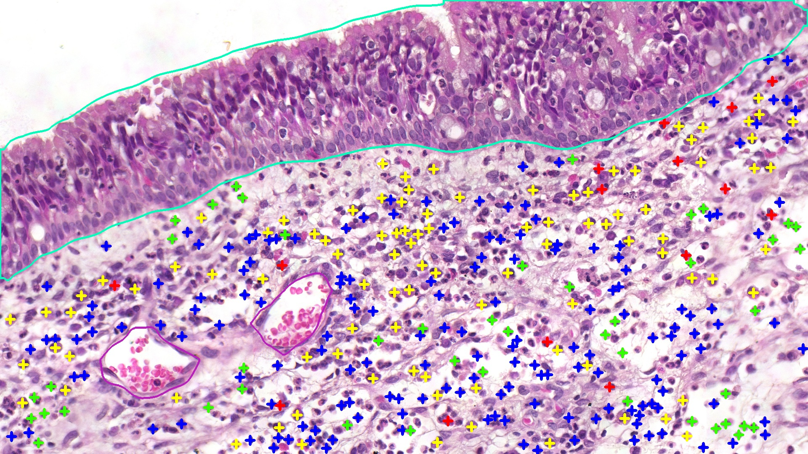

# NPSS

## Introduction
Nasal polyp (NP) is a highly heterogeneous disease and its pathological endotype is closely related to prognosis, but objective and accurate diagnostic tools for subtype are lacking. We develop a robust NP pathological subtype diagnosis system (NPSS) with artificial intelligence, contributing to precision diagnosis and individualized treatment. NPSS consists of two main parts, the first part is that we use [PA-P2PNet](https://arxiv.org/abs/2303.02602 "DPA-P2PNet: Deformable Proposal-aware P2PNet for Accurate Point-based Cell Detection") to detect cells. The second part uses [DeepLab V3+](https://github.com/VainF/DeepLabV3Plus-Pytorch "DeepLabV3Plus-Pytorch")(This part of the code is shown in this link and is no longer available here) to detect tissue areas.

This is the code for NPSS. For more details, please refer to our paper.

Code has been tested with Python 3.6 and Torch 1.10.

## Datasets
In this nationwide, multilevel, real-world evidence study, we collected 2,657 CRS slides from patients who underwent endoscopic sinus surgery across 24 hospitals in China. There are 1556 slides from 8 hospitals were used for internal development and validation of CEDA's cellular and regional detection capabilities, while 901 slides from other 12 hospitals was employed to the external test set to assess CEDA's general detection ability.

## How to train this model
To train the model, run the train.py program
```python
CUDA_VISIBLE_DEVICES=0,1 python -m torch.distributed.launch --nproc_per_node=2 --master_port=29510 train.py --output_dir=_savePath_.pth --eos_coef=0.8 --dataset=bxr --num_classes=4 --num_workers=4 --start_eval=50 --epochs=150 --batch_size=4
```

## Visualization of Results (4 classes + 3 classes, 1920 x 1080)
<p align="center">
    </br>
</p>

## NPSS-3D
You can download our software from BaiduYun or Google drive. When you unzip downloaded file you can see "PolypViewer.exe", run it and enjoy the digital 3d NP world.

[BaiduYun](https://pan.baidu.com/s/1wT1IUSAFg52latEgklSXlw?pwd=kqi1)


